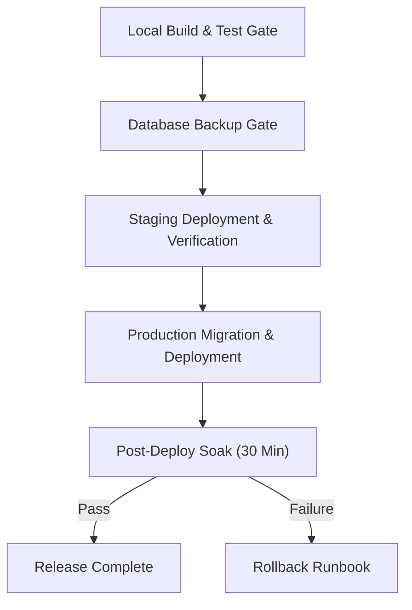

# Deployment Checklist (P9-5) — mylistsaddon.com

This checklist must be followed for every production deployment of **My Lists Addon**. Deployments are performed via the Cloudflare dashboard or Wrangler CLI.

---

## 🚦 Deployment Gate Summary



---

## Phase A: Pre-Deploy Verification Gate (Local)

Run these checks in order from the repository root:

- [ ] **1. Build Combined Worker:**
  ```bash
  python build.py
  ```
  *Assertion:* `worker_entry_combined.js` is generated with 0 build errors.

- [ ] **2. Check Source Synchronization:**
  ```bash
  python check_sync.py
  ```
  *Assertion:* Outputs `ok: worker_entry_combined.js matches its sources`.

- [ ] **3. Syntax Check Combined Worker:**
  ```bash
  node --check worker_entry_combined.js
  ```
  *Assertion:* Exits with code `0`.

- [ ] **4. First-View Bundle Budget Audit (P8-3):**
  ```bash
  node check_bundle_budget.mjs
  ```
  *Assertion:* First-view `/app.js` bundle $\le$ 150.00 KB gzip (currently ~93.26 KB).

- [ ] **5. Scope & Identifier Resolution Check:**
  ```bash
  npm install --no-save --no-audit --no-fund acorn@8.14.0 eslint-scope@8.2.0
  node scope_check.mjs worker worker_entry_combined.js
  ```
  *Assertion:* Every identifier resolves cleanly without TDZ or scope collisions.

- [ ] **6. HTML Living Standard & Render Check:**
  ```bash
  node render_check.js rendered.html
  python html_checks.py rendered.html
  ```
  *Assertion:* Passes with 0 HTML or nonce violations.

- [ ] **7. Execute Full Test Suite (1,850+ Tests):**
  ```bash
  node --test tests/*.test.mjs
  MLA_TEST_V2_LISTS_READ=1 node --test tests/*.test.mjs
  ```
  *Assertion:* 100% passing tests across both runs, including `tests/migration-suite.test.mjs` and `tests/security-suite.test.mjs`.

- [ ] **8. Regenerate Function Map:**
  ```bash
  python gen_map.py
  git diff --quiet -- FUNCTION-MAP.md || echo "FUNCTION-MAP.md was updated"
  ```

---

## Phase B: Pre-Deploy Database Backup Gate

Before touching any production database, ensure Time Travel is available and take a point-in-time export:

- [ ] **1. Export Production Database (`my-lists-db`):**
  ```bash
  npx wrangler d1 export my-lists-db --remote --output=backups/my-lists-db-pre-deploy-$(date +%Y%m%d_%H%M%S).sql
  ```
- [ ] **2. Export Activity Database (`mylists-activity`) if modified:**
  ```bash
  npx wrangler d1 export mylists-activity --remote --output=backups/mylists-activity-pre-deploy-$(date +%Y%m%d_%H%M%S).sql
  ```
- [ ] **3. Record Time Travel Bookmark:**
  ```bash
  npx wrangler d1 time-travel info my-lists-db
  ```
  Save the latest bookmark timestamp to rollback notes.

---

## Phase C: Staging Deployment & Rehearsal Gate

Deploy to the staging environment first to verify schema changes and edge execution:

- [ ] **1. Apply Pending SQL Migrations to Staging:**
  ```bash
  # Execute only new migrations against staging D1
  npx wrangler d1 execute my-lists-db-staging --file=migrations/XXXX_new_migration.sql --remote
  ```
- [ ] **2. Deploy Worker Code to Staging:**
  ```bash
  npx wrangler deploy --env staging
  ```
  *(Or paste `worker_entry_combined.js` into the `my-lists-addon-staging` dashboard editor).*
- [ ] **3. Execute Staging Smoke Tests:**
  - [ ] Home page renders: `curl -s -o /dev/null -w "%{http_code}" https://staging.mylistsaddon.com/` returns `200`.
  - [ ] Keyset directory returns data: `curl -s https://staging.mylistsaddon.com/lists/public.json | grep '"ok":true'`.
  - [ ] Stremio manifest loads: `curl -s https://staging.mylistsaddon.com/test_install/manifest.json | grep '"id":"com.mylistsaddon"'`.
  - [ ] Test queue job roundtrip: Log into staging `/admin` $\to$ Maintenance $\to$ **Send a test job**. Verify `mylists-jobs-staging-dlq` has 0 messages.
- [ ] **4. Run k6 Load Test Baselines (Optional but recommended for catalog/perf changes):**
  ```bash
  k6 run loadtests/catalog-hot-path.js -e BASE_URL=https://staging.mylistsaddon.com -e INSTALL_ID=test_install
  ```

---

## Phase D: Production Deployment Procedure

Perform the deployment during a low-traffic window:

- [ ] **1. Apply Database Migrations (Strict Sequential Order):**
  Apply any new migrations using the D1 Console or Wrangler:
  ```bash
  npx wrangler d1 execute my-lists-db --file=migrations/XXXX_new_migration.sql --remote
  ```
  *Note:* All migrations in `migrations/` are strictly additive and backward-compatible with running Workers.
- [ ] **2. Deploy Worker Code:**
  - Navigate to **Cloudflare Dashboard** $\to$ **Workers & Pages** $\to$ `my-lists-addon` $\to$ **Edit code**.
  - Select all and replace with the contents of `worker_entry_combined.js`.
  - Click **Save and Deploy**.
  - **Before pasting, save the Worker currently in the dashboard** (Select all, copy, keep it as `previous-worker.js` outside the repository). It is the fastest rollback.
  - **Do not run `npx wrangler deploy`** against production: see the warning at the top of `wrangler.toml`. Production is deployed by pasting.
- [ ] **2b. Confirm the right file is live:**
  - Open `/admin`. The heading line must read **Release N (build XXXXXXXXXX)**, where N is `WORKER_RELEASE` and the build matches the `build stamp:` line that `python build.py` printed (also shown by `python check_sync.py`).
  - If the build differs, the pasted file is not the one that passed the checks. Paste again from the committed `worker_entry_combined.js`.
  - Write the release and build in `docs/RELEASES.md` so there is a record of what was live when.
- [ ] **3. Verify Production Smoke Tests:**
  - [ ] `https://mylistsaddon.com/` loads cleanly with status `200`.
  - [ ] `https://mylistsaddon.com/lists/public.json` returns public directory items.
  - [ ] Install configuration loads and resolves catalogs.
  - [ ] Sign in to an existing account via `/api/session` (or UI).
  - [ ] Confirm no CSP violations are reported to `/api/csp-report`.

---

## Phase E: Post-Deploy Monitoring & 30-Minute Soak Period

Watch telemetry for 30 minutes following deployment:

- [ ] **1. Cloudflare Workers Metrics:**
  - Error rate must remain $< 0.1\%$.
  - Median CPU execution time must remain $< 15\text{ ms}$.
  - Subrequest failure rate must remain zero.
- [ ] **2. Real-time Logs:**
  - Cloudflare Dashboard $\to$ `my-lists-addon` $\to$ **Live Logs**.
  - Look for unhandled exceptions, D1 constraint violations, or syntax errors.
- [ ] **3. Queue Consumers & DLQ:**
  - Verify `mylists-jobs` continues processing messages.
  - Verify `mylists-jobs-dlq` contains 0 messages.
- [ ] **4. D1 Database Metrics:**
  - Verify D1 read and write operations stay within normal bounds.
  - Confirm pageviews are not generating write operations on `stats` (Analytics Engine handles pageviews).

---

## Phase F: Emergency Rollback Protocol

If an unrecoverable defect, latency spike, or data regression occurs during the soak period:

1. **Immediate Worker Code Rollback:**
   - In Cloudflare Dashboard $\to$ `my-lists-addon` $\to$ **Version History** (or Edit Code).
   - Roll back to the previous deployment version or re-paste the previously known-good `worker_entry_combined.js`.
   - Click **Save and Deploy**. (Rollback takes effect globally in $< 5\text{ seconds}$).
2. **Feature Flag Reversion:**
   - If a regression was triggered by a feature flag (`FF_V2_LISTS_READ`, `FF_EVENT_TRACKING`, etc.), disable the variable in Worker Settings $\to$ **Variables and Secrets**.
3. **Database Restore (If Corrupted):**
   - For point-in-time recovery, execute D1 Time Travel:
     ```bash
     npx wrangler d1 time-travel restore my-lists-db --bookmark=<saved_bookmark>
     ```
   - Or restore from the pre-deploy SQL export:
     ```bash
     npx wrangler d1 execute my-lists-db --file=backups/my-lists-db-pre-deploy-XXXX.sql --remote
     ```
